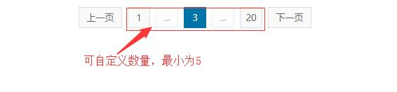

# xlPaging

一个简单的分页插件，支持ajax，可以自定义展示数量

## 效果展示




## 使用方法

1. ~~下载并引入JQuery和xlPaging.js~~ 下载并引入xlPaging.js
2. 在页面中增加一个盛放分页的DIV

    ``` javascript
         <div id="page"></div>
    ```

3. 在JS中对分页进行配置,其中pageNum为必写项。
   简单模式

   ```javascript
    let xlPaging =new Paging('page', {
      pageNum: 100, // 总页码
      callback: function (num) { //回调函数
        console.log(num);
      }
    })
    ```

    高级模式

    ```javascript
    let xlPaging =new Paging('page', {
      nowPage: 6, // 当前页码
      pageNum: 100, // 总页码
      buttonNum: 5, //要展示的页码数量
      canJump: 1,// 是否能跳转。0=不显示（默认），1=显示
      showOne: 1,//只有一页时，是否显示。0=不显示,1=显示（默认）
      callback: function (num) { //回调函数
        console.log(num);
      }
    })
    ```

4. 对分页进行个性化

  ``` javascript

  <style>
    //#page 的page是您自定义的id
        #page {
            margin: 20px auto;
            color: #666;
            display: block;
            text-align: center;
        }
    //所有li的样式
        #page li {
            display: inline-block;
            min-width: 30px;
            height: 28px;
            cursor: pointer;
            color: #666;
            font-size: 13px;
            line-height: 28px;
            background-color: #f9f9f9;
            border: 1px solid #dce0e0;
            text-align: center;
            margin: 0 4px;
            -webkit-appearance: none;
            -moz-appearance: none;
            appearance: none;
        }
    //上一页和下一页的样式
        .xl-nextPage,.xl-prevPage {
            width: 60px;
            color: #0073A9;
            height: 28px;
        }
    //失效状态样式
        #page li.xl-disabled {
            opacity: .5;
            cursor: no-drop;
        }
    //当前页码显示状态
        #page li.xl-active {
            background-color: #0073A9;
            border-color: #0073A9;
            color: #FFF
        }
    //跳转文字
     #page li.xl-jumpText {
        background-color: rgba(0,0,0,0);
        border-color: rgba(0,0,0,0);
        opacity: 1;
      }
    //跳转按钮
    #page li.xl-jumpButton{
      padding: 0 5px;
    }
    </style>
  // 样例中的样式

  <style>

    #page {
        margin: 20px auto;
        color: #666;
        display: block;
        text-align: center;
    }

    #page li {
        display: inline-block;
        min-width: 30px;
        height: 28px;
        cursor: pointer;
        color: #666;
        font-size: 13px;
        line-height: 28px;
        background-color: #f9f9f9;
        border: 1px solid #dce0e0;
        text-align: center;
        margin: 0 4px;
        -webkit-appearance: none;
        -moz-appearance: none;
        appearance: none;
    }

    .xl-nextPage,
    .xl-prevPage {
        width: 60px;
        color: #0073A9;
        height: 28px;
    }

    #page li.xl-disabled {
        opacity: .5;
        cursor: no-drop;
    }

    #page li.xl-disabled:hover{
      background-color: #f9f9f9 !important;
        border: 1px solid #dce0e0 !important;
      color: #666 !important;
    }

    #page li.xl-active {
        background-color: #0073A9;
        border-color: #0073A9;
        color: #FFF
    }

    #page li:hover{
      background-color: #0073A9 !important;
        border-color: #0073A9;
        color: #FFF
    }

     #page li.xl-jumpText {
        background-color: rgba(0,0,0,0);
      border-color: rgba(0,0,0,0);
      opacity: 1;
    }

    #page li.xl-jumpText:hover{
      background-color: rgba(0,0,0,0) !important;
      border-color: rgba(0,0,0,0) !important;
    }

    #page li.xl-jumpButton{
      padding: 0 5px;
    }

    #xlJumpNum {
      width: 35px;
      margin: 0 3px;
    }
    input::-webkit-outer-spin-button,input::-webkit-inner-spin-button{
      -webkit-appearance: none !important;
    }
    input[type="number"]{
      -moz-appearance:textfield;
    }
  </style>

  ```

## 分页结构

```javascript
    <div id="page">
        <ul>
            <li class="xl-prevPage">上一页</li>
            <li>1</li>
            <li class="xl-disabled">...</li>
            <li>17</li>
            <li>18</li>
            <li>19</li>
            <li class="xl-active">20</li>
            <li class="xl-nextPage xl-disabled">下一页</li>
            <li class="xl-jumpText xl-disabled">跳转到<input type="number" id="xlJumpNum">页</li>
            <li class="xl-jumpButton">确定</li>
        </ul>
    </div>
```

## 交流QQ群725227425

1. 可以交流一下前端技术

## 下一步计划

1. 增加多种样式
2. ~~去JQuery~~
3. 使用虚拟dom提高性能
